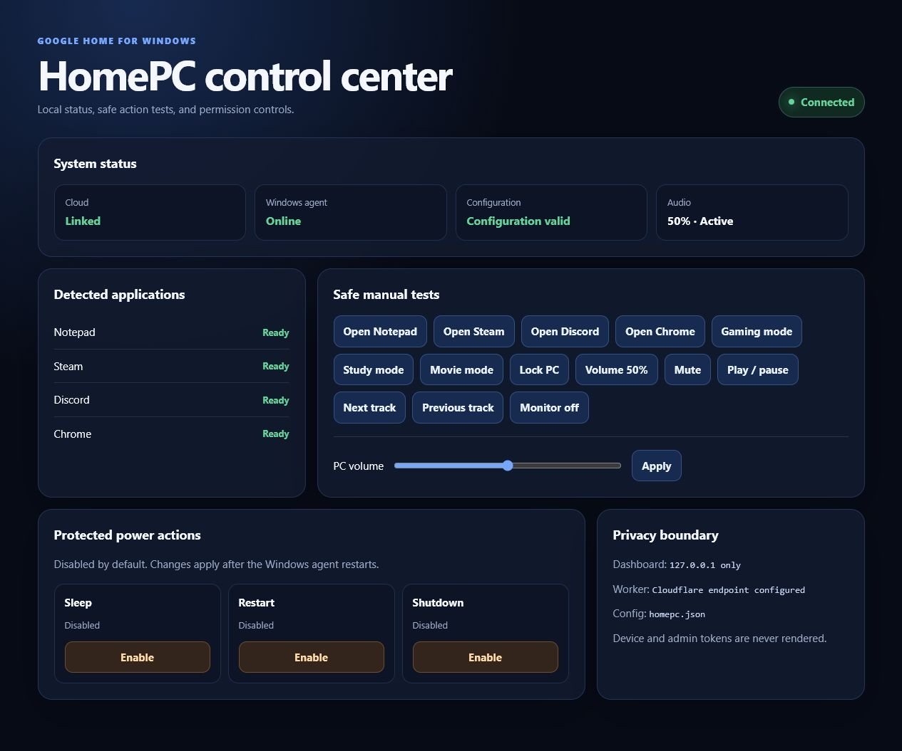
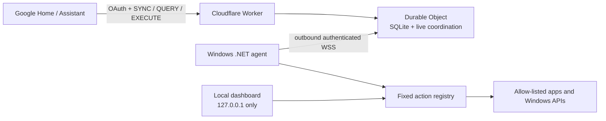

# HomePC

Control a Windows PC from Google Home without opening an inbound port or exposing a remote shell.

HomePC publishes a fixed set of safe Windows actions as Google Home switches. A .NET agent keeps one authenticated outbound WebSocket connection to a Cloudflare Durable Object, while Google Home communicates with a standards-based Cloud-to-cloud fulfillment service.

> **Status:** working private-test release. Google Home account linking, device discovery, live Cloudflare deployment, and the Windows agent have all been verified end to end.

<p align="center">
  
</p>

<p align="center">
  
</p>

## Features

- Native controls inside Google Home for apps, media, display, modes, and guarded PC power actions.
- OAuth 2.0 authorization-code account linking with expiring codes, refresh tokens, and revocation.
- Cloudflare Worker plus SQLite-backed Durable Object and WebSocket hibernation.
- .NET 8 Windows agent with replay protection, strict message validation, and a fixed action registry.
- Polished localhost dashboard for status, application detection, safe tests, and protected permissions.
- No inbound PC port, arbitrary command endpoint, uploaded script, or remote executable path.
- Automated TypeScript and .NET tests, release packaging, and GitHub Actions CI.

## Architecture



## Supported controls

| Category | Google Home devices |
|---|---|
| Applications | Open Notepad, Steam, Discord, Chrome |
| Modes | Gaming, Study, Movie |
| Media | Mute, Play/Pause, Next, Previous |
| Windows | Lock PC, Monitor Off |
| Protected power | Sleep, Restart, Shutdown — disabled by default |
| Local dashboard | Numeric PC volume and manual safe tests |

See [docs/COMMANDS.md](docs/COMMANDS.md) for behavior and safety rules.

## Prerequisites

- Windows 10 or 11
- [.NET 8 SDK](https://dotnet.microsoft.com/download/dotnet/8.0)
- [Node.js LTS](https://nodejs.org/) and npm
- A free [Cloudflare account](https://dash.cloudflare.com/)
- A [Google Home Developer Console](https://console.home.google.com/) project
- Google Home on a phone using the same Google account as the developer project

## Setup

### 1. Create the Google Home project

1. Open the [Google Home Developer Console](https://console.home.google.com/).
2. Create a project and add a **Cloud-to-cloud** integration.
3. Copy the immutable project ID, not only the display name.

Do not choose Matter for this release. Matter uses commissioning QR codes; HomePC v1 uses Cloud-to-cloud account linking.

### 2. Generate private configuration

From the repository root:

```powershell
.\tools\bootstrap.ps1 -ProjectId YOUR_GOOGLE_PROJECT_ID
```

This creates three gitignored files under `generated/`:

- `worker-secrets.json` — Cloudflare Worker secrets
- `homepc.json` — Windows agent configuration
- `google-home-values.txt` — values to paste into Google Home Developer Console

The script will not silently overwrite existing secrets.

### 3. Deploy the Cloudflare backend

For a new Cloudflare account, open **Workers & Pages** once and initialize the account's `workers.dev` subdomain. Then run:

```powershell
.\tools\deploy-cloudflare.ps1
```

The deployment script installs dependencies, generates Worker types, type-checks, tests, uploads secrets, deploys, and writes the final Worker URL back into the generated configuration.

Confirm the health endpoint:

```powershell
curl.exe https://YOUR_WORKER.workers.dev/health
```

Expected response:

```json
{"ok":true,"service":"homepc-cloud"}
```

### 4. Configure Google Home

Open `generated/google-home-values.txt` and copy its values into the Cloud-to-cloud integration.

| Console field | Value |
|---|---|
| Integration name | `HomePC` |
| Device type | `Switch` |
| OAuth Client ID / secret | Generated values |
| Authorization URL | `https://YOUR_WORKER.workers.dev/oauth/authorize` |
| Token URL | `https://YOUR_WORKER.workers.dev/oauth/token` |
| Fulfillment URL | `https://YOUR_WORKER.workers.dev/smarthome` |
| Scope | `homepc.control` |
| HTTP Basic Auth | **Off** — use Google's default request-body credentials |
| Icon | Rename `assets/PROJECT_ID.png` to the exact project ID plus `.png` |

Save the integration. Go to **Cloud-to-cloud → Test** and click **Test** once so the unpublished integration becomes visible to the project owner.

### 5. Start the Windows agent

```powershell
dotnet publish .\src\HomePC.Agent -c Release -r win-x64 --self-contained false
dotnet run --project .\src\HomePC.Agent -- --config .\generated\homepc.json
```

For desktop actions such as opening Notepad, run the agent in the signed-in user's session. A Windows Service runs in session 0 and cannot reliably display GUI apps. See [docs/WINDOWS_AGENT.md](docs/WINDOWS_AGENT.md).

### 6. Link Google Home

1. Open Google Home with the developer project's Google account.
2. Tap **Add → Device**.
3. If the QR scanner appears, choose **Add a different way**.
4. Search for **`[test] HomePC`**.
5. Enter the generated link password.
6. Select the HomePC devices and add them to a room.
7. Test **Open Notepad** first.

The password page is used only for the initial OAuth account-linking step. After linking, the controls live directly inside Google Home.

### 7. Run the local dashboard

```powershell
dotnet run --project .\src\HomePC.Dashboard -- --config .\generated\homepc.json
```

Open [http://127.0.0.1:5187](http://127.0.0.1:5187). The dashboard binds only to localhost and never renders the device or admin tokens.

## Configuration

Start with [config/homepc.example.json](config/homepc.example.json). Application overrides and mode URLs remain local to the PC. Unknown actions, extra command fields, expired messages, duplicates, and unapproved power operations are rejected.

## Validation

Run the complete verification suite:

```powershell
.\tools\verify.ps1
```

Current recorded results are in [VERIFICATION.md](VERIFICATION.md). The repository also includes GitHub Actions CI in `.github/workflows/ci.yml`.

## Security model

- The agent initiates the connection; the PC does not accept inbound internet traffic.
- Cloud requests contain action identifiers, not shell commands or executable paths.
- Sleep, restart, shutdown, process closing, and power-plan changes require local opt-in.
- Tokens and generated configuration are excluded from Git.
- The dashboard is localhost-only and redacts secrets.

Read the full [security model](docs/SECURITY.md) before enabling protected actions.

## Troubleshooting

The most common setup failures and their fixes are documented in [docs/TROUBLESHOOTING.md](docs/TROUBLESHOOTING.md). In particular:

- A looping Android account-link page requires the current Worker release, which allows Google's callback origin and uses a `303` post-login redirect.
- Keep **HTTP Basic Auth off** in Google Home Developer Console unless you intentionally change the server configuration.
- If the integration is missing, click **Test** in Developer Console using the same Google account as the phone.

## Next update: custom instructions

The next planned release adds user-defined routines such as “focus mode” or “open my work setup.” It will remain allow-list based: custom instructions will compose approved actions and parameters, never arbitrary PowerShell, CMD, scripts, or remote paths.

See [docs/ROADMAP.md](docs/ROADMAP.md) for the proposed schema, validation, dashboard editor, dry-run mode, and migration plan.

## Repository guide

| Path | Purpose |
|---|---|
| `cloud/` | Cloudflare Worker, Durable Object, OAuth, Google intents |
| `src/HomePC.Agent/` | Windows WebSocket agent |
| `src/HomePC.Core/` | Models, validation, action registry |
| `src/HomePC.Windows/` | Allow-listed Windows integrations |
| `src/HomePC.Dashboard/` | Local status and safe test UI |
| `tests/` | .NET tests |
| `tools/` | Bootstrap, deploy, verify, and release scripts |
| `docs/` | Architecture, setup, security, commands, and roadmap |

## Contributing

See [CONTRIBUTING.md](CONTRIBUTING.md). Security-sensitive changes should preserve the fixed action boundary and include tests.

## License

[MIT](LICENSE)
