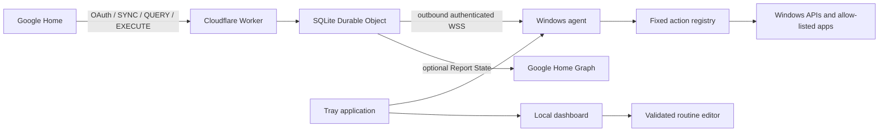

# Architecture

The Worker validates OAuth and Google Home requests. A single SQLite-backed Durable Object owns OAuth state, the authenticated agent socket, dynamic routine descriptors, current state and a bounded audit trail.

EXECUTE maps device/trait commands to fixed action IDs and waits up to eight seconds for the matching result. A WebSocket send alone is never considered success. Dynamic routine names arrive in the authenticated agent hello message; only validated IDs and display names are stored in the cloud.

The agent validates size, JSON, expiry, future timestamps, action IDs, parameters and replay IDs. A custom routine is expanded locally into at most 12 independently validated fixed actions. Permission checks remain active for every step.

The dashboard and tray are optional local operator surfaces. The dashboard binds to `127.0.0.1`; the agent never opens an inbound network listener.
